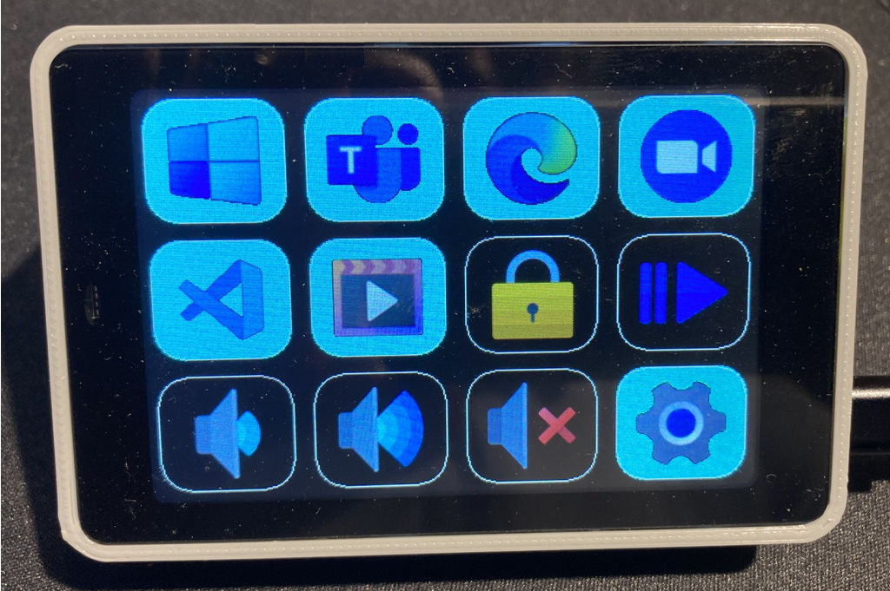

# FreeTouchDeckWT32
This is a port of Dustin Watt's FreeTouchDeck project (https://github.com/DustinWatts/FreeTouchDeck.git) to the to the WT32-SC01 integrated ESP32, LCD, and capacitive touch screen board. http://www.wireless-tag.com/portfolio/wt32-sc01/

Other than adapting to the board, the main change is to allow more buttons per page  - the screen area is just a bit smaller than the size of twelve StreamDeck buttons which seems reasonable. The code is currently set to three rows of four buttons, but can be changed to three rows of five buttons (or two rows of four, etc.) by modifying FreeTouchDeckWT32.h: "#define BUTTON_ROWS 3" and "#define BUTTON_COLS 5".  In principle it should support larger arrays, but not tested, and the configurator page is set to a maximum of 3x5. 

The configurator displays an array of three rows of five buttons, with a drop down list to select the menu page to be modified. If you are using fewer than 3x5, simply ignore the extra rows and columns. On the to-do list is to generate the HTML dynamically to correspond with the number of rows and columns.

To aid the configurability to adapt to different mnenu layout, the code now has an array of  Menus (pages).  Each Menu has a 2D array of Buttons, each Button has an array of 3 Actions, etc.  The code ends up addressing a specific button with something like "menu[pageNum].button[row][row].islatched = true;" Rather than a dedicated home page and a dedicated return to home in the bottom right of each page each button on each page can be modified, and in principle any page could call any other. There is no protection to force a button that provides a way out of a menu, so make sure that you define one.

Other changes: 
1. There are now 10 pages. This includes Menu0 (home).
2. Updated to latest platformio Arduino platform (2.x)
3./Changed from SPIFFS to LittleFS. Note that if you check the serial monitor output you will see some error messages like "[vfs_api.cpp:104] open(): /littlefs/list does not exist". This is a known issue with ESPAsyncWebsServer related to LittleFS supporting folders while SPIFFS does not. See https://github.com/lorol/LITTLEFS/issues/2 for more on the topic.

